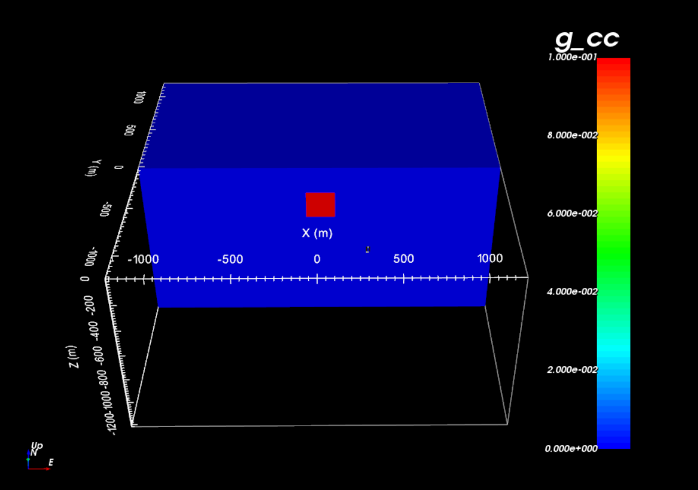

.. _example_model:

Create Model
============

Here the code **blk3cell.exe** and the input file **blk3cell.inp** are used to create a density contrast model on the tensor mesh provided (**mesh.txt**). Files relevant to this part of the example are in the sub-folder *model*. Before running this example, you may want to do the following:

	- `Download and open the zip folder containing the entire grav3d example <https://github.com/ubcgif/grav3d/raw/v6/assets/grav3d_v6_example.zip>`__ (if not done already)
	- Learn how to :ref:`run blk3cell <grav3d_blk3cell>`
	- Learn the format of the :ref:`input file <grav3d_blk3cell_input>`

Here is the input file used to generate the synthetic model.

.. figure:: images/model_input.png
     :align: center
     :width: 700

The resulting tensor model shows a more dense block (:math:`\rho` = 0.1 :math:`g/cm^3` ) within a negligible background (:math:`\rho_0` = 0 :math:`g/cm^3` ). The region has a constant topography of 0 m.

