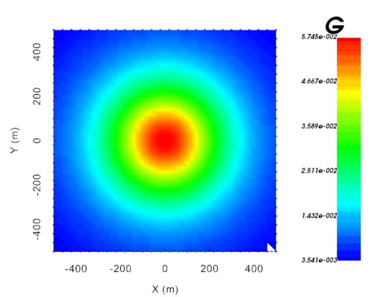

.. _example_fwd:

Forward Modeling
================

Here the code **gzfor3d.exe** is used to forward model the gravity anomaly for the mesh and density contrast model provided. We consider a ground-based survey with a uniform station spacing of 40 m.

Files relevant to this part of the example are in the sub-folder *fwd*. We used the same model that was created in the :ref:`create model <example_model>` section. Before running this example, you may want to do the following:

	- `Download and open the zip folder containing the entire grav3d example <https://github.com/ubcgif/grav3d/raw/master/assets/grav3d_example.zip>`__ (if not done already)
	- Learn how to run :ref:`gzfor3d<gzfor3d>`
	- There is no input file

The resulting gravity anomaly (mgal) is shown below. According to the convention used by *grav3d*, a positive density contrast results in a positive gravity anomaly.

