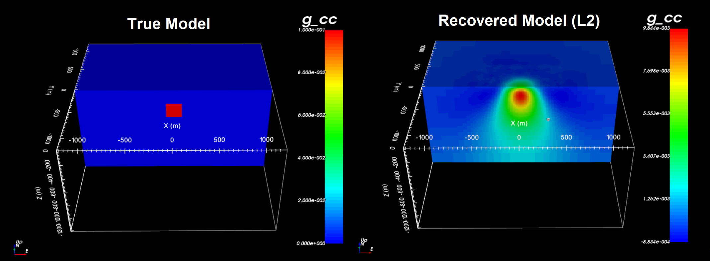

.. _example_inv:

.. note:: This example has been developed to demonstrate functionality specific to v6.0. The example can be completed using v5.0, however some functionality may not exist in v5.0 and the format of certain input files may differ slightly.

Inversion
=========

Here the code **gzinv3d_v60.exe** invert synthetic gravity anomaly data to recover a density contrast model. We perform both a smooth and a sparse inversion. We use the same data that were computed in :ref:`forward modeling example <example_fwd>`. Gaussian noise were added to these data with a standard deviation of 5e-4 mgal. Uncertainties of 5e-4 mgal were assigned to all data

Before running this example, you may want to do the following:

     - `Download and open the zip folder containing the entire grav3d example <https://github.com/ubcgif/grav3d/raw/master/assets/grav3d_example.zip>`__ (if not done already)
     - Learn how to :ref:`run gzinv3d_v60 and learn the format of the input files <gzinv3d>`

.. important:: Since the sensitivities output by **gzsen3d_v60.exe** produce a large file, we have not provided them in the zip file. You need to complete the :ref:`compute sensitivities <example_sensitivity>` example to run the inversion.

Smooth Inversion
^^^^^^^^^^^^^^^^

For standard L2 inversion, we use the input file **inv_L2.inp** and the supporting files in the sub-folder *inv_L2*. The input file is shown below.

.. figure:: images/inv_L2_input.png
     :align: center
     :width: 700

The algorithm reaches an optimum model after 5 iterations. Least-squares gravity inversion will generally place structures at the approprate locations but will underestimate the amplitude of density contrast. 

Smooth Inversion
^^^^^^^^^^^^^^^^

For sparse inversion, we use the input file **inv_sparse.inp** and the supporting files in the sub-folder *inv_sparse*. The input file is shown below.

.. figure:: images/inv_sparse_input.png
     :align: center
     :width: 700

The inversion was set to recover a model that is more compact. By forcing the model to be compact, we recover a structure who density contrast of much closer to the true value of 0.1 g/cc. 

.. figure:: images/model_sparse.png
     :align: center
     :width: 700
