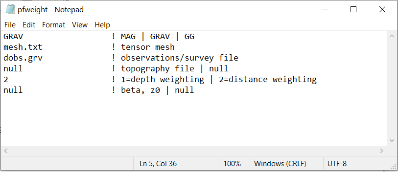
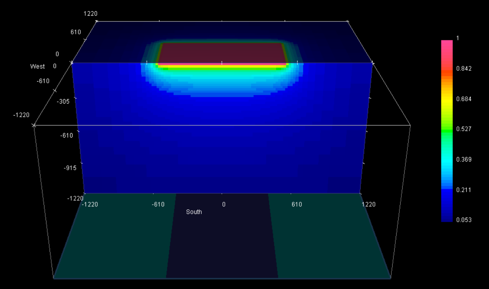

.. _example_weights:

Depth/Distance Weighting
========================

Here the code **pfweight.exe** and the input file **pfweight.inp** is used to generate distance weighting for the inversion. Files relevant to this part of the example are in the sub-folder *pfweights*. Before running this example, you may want to do the following:

	- `Download and open the zip folder containing the entire grav3d example <https://github.com/ubcgif/grav3d/raw/master/assets/grav3d_example.zip>`__ (if not done already)
	- Learn how to :ref:`run pfweight and learn the format of the input files <pfweight>`

Here is the input file for **pfweight.exe**

The resulting distance weights are plotted on the mesh below.

