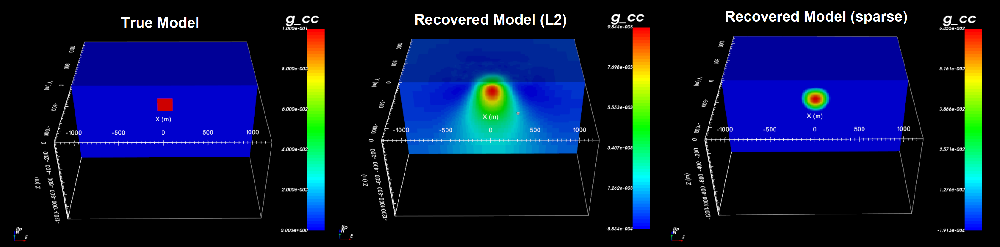

.. _example:

.. note:: A new example has been developed for demonstrating functionality specific to v6.0. The example can be completed using v5.0, however some functionality may not exist in v5.0 and the format of certain input files may differ slightly.

Examples
========

Here, the program libraries for Grav3d v6.0 will be used to:

    - define a density contrast model on a tensor mesh
    - predict gravity anomaly data for a synthetic density contrast model
    - generate sensitivity weights for the inverse problem
    - compute and store the sensitivity matrix
    - invert gravity anomaly data to recover a density contrast model

Zip folders containing all necessary files can be downloaded here:

    - `Files for grav3d v6 example <https://github.com/ubcgif/grav3d/raw/v6.0/assets/grav3d_v6_example.zip>`__

The full example is parsed into 5 sections:

.. toctree::
    :maxdepth: 1

    Create tensor model <example/create_model>
    Forward modeling <example/fwd>
    Weights <example/weights>
    Least-squares inversion <example/inv_L2>
    Sparse norm inversion <example/inv_sparse>