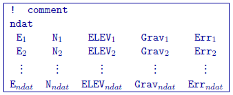
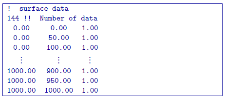
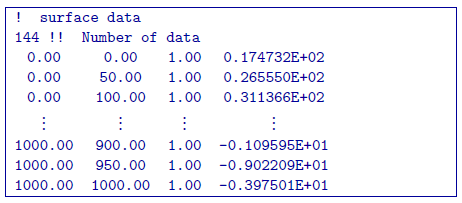
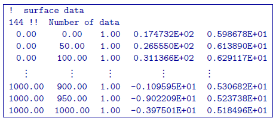

.. _gravfile:

Observations/Survey File
========================

Here, we demonstrate the format of the survey, predicted data and observations files that are compatible with **gzfor3d.exe** and **gzinv3d_60.exe**. For forward modeling, the survey file will contain the observation locations. In addition to this information, the predicted data file will have an additional column containing the data predicted for a given model. Observation files will contain a data column as well as a column for the uncertainties on the data.

The general format for data files compatible with **gzfor3d.exe** and **gzinv3d_60.exe** is as follows:

Parameter Definitions
^^^^^^^^^^^^^^^^^^^^^

    - *!:* Any line beginning with a ! is ignored an represents a comment line.

    - **ndat:** Number of observation locations.

    - **E, N, ELEV:** Easting, Northing and elevation for each observation location in meters. Elevation should be above the topography for surface data, and below the topography for borehole data. The observation locations can be listed in any order.

    -  :math:`\mathbf{Grav_n}`: Gravity anomaly data in mGal. This column is only present in *predicted data* and *observed data* files.

    -  :math:`\mathbf{Err_n}`: Standard deviation for the error on the corresponding datum (i.e. uncertainty). This represents the absolute error. It must be positive and non-zero. This column is only required in *observed data* files.

.. important:: It should be noted that the data are **extracted anomalies**, which are derived by removing the regional from the field measurements. Furthermore, the inversion program assumes that the anomalies are produced by a density contrast distribution in g/cm :math:`^3` with mesh cells in meters. Therefore, it is crucial that the data be prepared in ``mGal``.

Examples 
^^^^^^^^

**Survey File:**

**Predicted Data File:**

**Observations File:**

