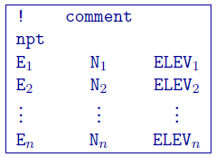
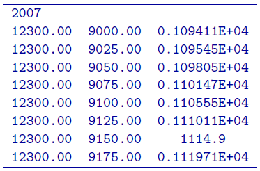

.. _topofile:

Topography file
===============

This file is used to define the surface topography of a mesh/model by the elevation at different locations. Lines starting with ! are comments. The topography file has the following general structure:

Parameter definitions:

-  npt: Number of points defining the topographic surface.

-  E\ :math:`_i`: Easting of the :math:`i^{th}` point on the surface.

-  N\ :math:`_i`: Northing of the :math:`i^{th}` point on the surface.

-  ELEV\ :math:`_i`: Elevation (metres) of the :math:`i^{th}` point on the profile.

The lines in this file can be in any order as long as the total number is equal to npt. The topographic data need not be supplied on a regular grid. GIF inversion codes assume a set of scattered points for generality and use a triangulation-based interpolation to determine the surface elevation above each column of cells. To ensure the accurate discretization of the topography, it is important that the topographic data be supplied over the entire area above the model and that the supplied elevation data points are not too sparse.

**NOTE 2**: Only the cells completely below the (interpolated) topographic surface are kept. The cells above or at the topographic surface are removed from the model, although these must still be included in the as if they are a part of the model. For input model files these cells can be assigned any value. The recovered model produced by inversion program also includes the cells that are excluded from the model, but these cells will have unrealistic values and be set to -100.

Example:
--------

The following is an example of a topography file:

