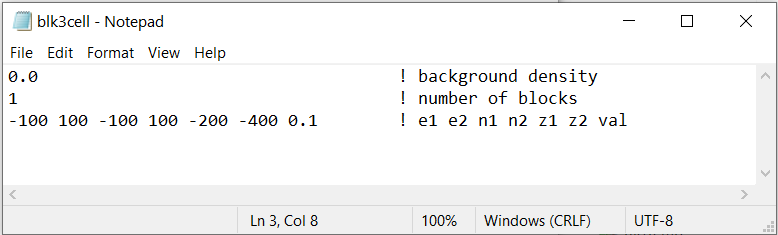

.. _grav3d_blk3cell_input:

Create Model Input File
=======================

The input file defines the properties of the density contrast model created using **blk3cell.exe**. The user specifies the locations, dimensions and values for a set of blocks. All undefined cells within the mesh are set to the background value. The format for this file is as follows:

.. tabularcolumns:: |C|C|C|

+----------------+----------------------------------------------------------------------------------------------------------------------+----------------------------------------+
| Line #         | Parameter                                                                                                            | Description                            |
+================+======================================================================================================================+========================================+
| 1              |:math:`\rho_b`                                                                                                        | background value                       |
+----------------+----------------------------------------------------------------------------------------------------------------------+----------------------------------------+
| 2              |:math:`N`                                                                                                             | number of blocks                       |
+----------------+----------------------------------------------------------------------------------------------------------------------+----------------------------------------+
| 3              |:math:`x_1^{(1)} \;\;  x_2^{(1)} \;\; y_1^{(1)} \;\; y_2^{(1)} \;\; z_{top}^{(1)} \;\; z_{bottom}^{(1)} \;\; m^{(1)}` | Block 1                                |
+----------------+----------------------------------------------------------------------------------------------------------------------+----------------------------------------+
| 4              |:math:`x_1^{(2)} \;\;  x_2^{(2)} \;\; y_1^{(2)} \;\; y_2^{(2)} \;\; z_{top}^{(2)} \;\; z_{bottom}^{(2)} \;\; m^{(2)}` | Block 2                                |
+----------------+----------------------------------------------------------------------------------------------------------------------+----------------------------------------+
| :math:`\vdots` |:math:`\;\;\;\;\;\;\;\;\;\;\;\vdots`                                                                                  | :math:`\;\;\vdots`                     |
+----------------+----------------------------------------------------------------------------------------------------------------------+----------------------------------------+
|                |:math:`x_1^{(N)} \;\;  x_2^{(N)} \;\; y_1^{(N)} \;\; y_2^{(N)} \;\; z_{top}^{(N)} \;\; z_{bottom}^{(N)} \;\; m^{(N)}` | Block N                                |
+----------------+----------------------------------------------------------------------------------------------------------------------+----------------------------------------+

where superscript :math:`(i)` for :math:`i=1,2,...,N` refers to a particular block. :math:`x_1,x_2,y_1,y_2,z_{top}` and :math:`z_{bottom}` define the dimensions of each block and :math:`m` defines the density contrast value. An example is shown below.

     Example input file for blk3cell (`Download <https://github.com/ubcgif/grav3d/raw/v6/assets/input_files/blk3cell.inp>`__ )

