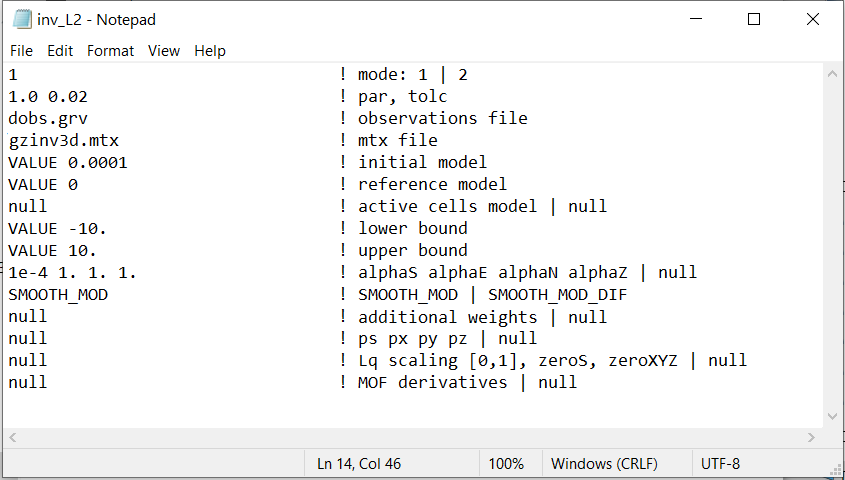

.. _grav3d_inv_input:

Inversion Input File
====================

The lines of input file for **gzinv3d_60.exe** are as follows:

.. tabularcolumns:: |L|C|C|

+--------+--------------------------------------------------------------------+-------------------------------------------------------------------+
| Line # | Description                                                        | Description                                                       |
+========+====================================================================+===================================================================+
| 1      | :ref:`Inversion mode<grav3d_input_inv_ln1>`                        | 1, 2 or 3                                                         |
+--------+--------------------------------------------------------------------+-------------------------------------------------------------------+
| 2      | :ref:`Beta parameter and tolerance<grav3d_input_inv_ln2>`          | *par tol*                                                         |
+--------+--------------------------------------------------------------------+-------------------------------------------------------------------+
| 3      | :ref:`Observations file<grav3d_input_inv_ln3>`                     | path to observations file                                         |
+--------+--------------------------------------------------------------------+-------------------------------------------------------------------+
| 4      | :ref:`Sensitivity matrix<grav3d_input_inv_ln4>`                    | path to sensitivity (.mtx) file                                   |
+--------+--------------------------------------------------------------------+-------------------------------------------------------------------+
| 5      | :ref:`Initial model<grav3d_input_inv_ln5>`                         | initial model                                                     |
+--------+--------------------------------------------------------------------+-------------------------------------------------------------------+
| 6      | :ref:`Reference model<grav3d_input_inv_ln6>`                       | reference model                                                   |
+--------+--------------------------------------------------------------------+-------------------------------------------------------------------+
| 7      | :ref:`Active model<grav3d_input_inv_ln7>`                          | sets active cells in inversion                                    |
+--------+--------------------------------------------------------------------+-------------------------------------------------------------------+
| 8      | :ref:`Upper bounds<grav3d_input_inv_ln8>`                          | upper bounds for cells                                            |
+--------+--------------------------------------------------------------------+-------------------------------------------------------------------+
| 9      | :ref:`Lower bounds<grav3d_input_inv_ln9>`                          | lower bounds for cells                                            |
+--------+--------------------------------------------------------------------+-------------------------------------------------------------------+
| 10     | :ref:`alpha_s alpha_x alpha_y alpha_z<grav3d_input_inv_ln10>`      | weighting constants for smallness and smoothness constraints      |
+--------+--------------------------------------------------------------------+-------------------------------------------------------------------+
| 11     | :ref:`Hard constraints<grav3d_input_inv_ln11>`                     | SMOOTH_MOD or SMOOTH_MOD_DIF                                      |
+--------+--------------------------------------------------------------------+-------------------------------------------------------------------+
| 12     | :ref:`Additional weights<grav3d_input_inv_ln12>`                   | add additional weights to cells or faces                          |
+--------+--------------------------------------------------------------------+-------------------------------------------------------------------+
| 13     | :ref:`Set compact and blocky norms<grav3d_input_inv_ln13>`         | Set compact and blocky norms                                      |
+--------+--------------------------------------------------------------------+-------------------------------------------------------------------+
| 14     | :ref:`Compact and blocky norm scaling<grav3d_input_inv_ln14>`      | *scale eps epsGrad*                                               |
+--------+--------------------------------------------------------------------+-------------------------------------------------------------------+
| 15     | :ref:`MOF derivatives<grav3d_input_inv_ln15>`                      | Set as *null* for the time-being                                  |
+--------+--------------------------------------------------------------------+-------------------------------------------------------------------+

An example of the input file for L2 inversion is shown below. You may also `Download the input file for a sparse norm inversion <https://github.com/ubcgif/grav3d/raw/v6.0/assets/grav3d_input/inv_sparse.inp>`__ .

     Example input file for the inversion (`Download <https://github.com/ubcgif/grav3d/raw/v6.0/assets/grav3d_input/inv_L2.inp>`__ ).

Line Descriptions
^^^^^^^^^^^^^^^^^

.. _grav3d_input_inv_ln1:

    - **Inversion mode:** An integer specifying one of two choices for determining the trade-off parameter.

        - *1* - the program chooses the trade off parameter by carrying out a line search so that the target value of data misfit is achieved (e.g. :math:`\phi^*_d = N`)
        - *2* - the user inputs the trade off parameter.
        - *3* - the program calculates the trade off parameter by applying the GCV analysis to the inversion without positivity constraint

.. _grav3d_input_inv_ln2:

    - **Beta parameter and tolerance:** Two real numbers *par* and *tol* that depend upon the value on *Line 1*.

           - If *inversion mode = 1*,  the target misfit value is given by the product of *par* and the number of data :math:`N` , i.e., *par=1* is equivalent to :math:`\phi_d^*=N` and *par=0.5* is equivalent to :math:`\phi_d^*=N/2` . The second parameter, *tol*, is the misfit tolerance in fractional percentage. The target misfit is considered to be achieved when the relative difference between the true and target misfits is less than *tolc*. Normally, *par=1* is ideal if the true standard deviation of error is assigned to each datum. When *tol=0*, the program assumes a default value of *tol=0.02* since this number must be positive.

           - If *inversion mode = 2*, *par* is the value of the trade off parameter. In this case, *tol* is not used by the program.

           - If *inversion mode = 3*, parameters *par* and *tol* are unused. However, dummy values must still be provided on this line.

.. _grav3d_input_inv_ln3:

    - **Observations file:** filepath to the :ref:`observations file <gravfile>`

.. _grav3d_input_inv_ln4:

    - **Sensitivity matrix:** filepath to the binary file containing the sensitivity matrix.

.. _grav3d_input_inv_ln5:

    - **Initial model:** The initial susceptibility model (SI) can be defined as a value for uniform models (e.g. *VALUE 0.001*), or by a filename. The initial model must be within the upper and lower bounds.

.. _grav3d_input_inv_ln6:

    - **Reference model:** The reference susceptibility model (SI) can be defined as a value for uniform models (e.g. *VALUE 0*), or by a filename (for non-uniform reference models).

.. _grav3d_input_inv_ln7:

    - **Active cells:** Use the flag *null* if all cells below the surface topography are active in the inversion. Or provide the filepath to an :ref:`active model file <activeFile>` to define the active cells.

.. _grav3d_input_inv_ln8:

    - **Lower bound:**

        - Use the flag *null* for no lower bound.
        - Use the flag *VALUE* followed by a numeric value to apply the same lower bound to all cells
        - Enter the filepath to a model file to set individual lower bounds to each cell

.. _grav3d_input_inv_ln9:

    - **Upper bound:**

        - Use the flag *null* for no upper bound.
        - Use the flag *VALUE* followed by a numeric value to apply the same upper bound to all cells
        - Enter the filepath to a model file to set individual upper bounds to each cell

.. _grav3d_input_inv_ln10:

    - **alpha_s alpha_x alpha_y alpha_z:** `Alpha parameters <http://giftoolscookbook.readthedocs.io/en/latest/content/fundamentals/Alphas.html>`__ . Here, the user specifies the relative weighting between the smallness and smoothness component penalties on the recovered models. As a default setting, *alpha_x=alpha_y=alpha_z=1* and *alpha_s=1/h* :math:`\!^2` is suggested, where *h* is the average dimension of cells in the core region.

.. _grav3d_input_inv_ln11:

    - **Hard constraints:** Here, the user specifies whether how the reference model is used to constrain the inversion; go to `fundamentals of inversion <http://giftoolscookbook.readthedocs.io/en/latest/content/fundamentals/MrefInSmooth.html>`__ to see how this is implemented. For the MTZTEM package:

        - use the flag *SMOOTH_MOD* to ignore the reference model (essential set :math:`m_{ref}=0` )
        - use the flag *SMOOTH_MOD_DIF* to include :math:`m_{ref}` in the smallness and smoothness penalty terms

.. _grav3d_input_inv_ln12:

    - **Additional weights:** Name of the :ref:`weights file <weightsFile>` containing weighting matrices. If *null* is entered, default values of unity are used (no extra weighting).

.. _grav3d_input_inv_ln13:

    - **Set compact and blocky norms:**

        - For least-square inversion, use the flag *null*
        - For compact and blocky norms, enter the flat *VALUE*, followed by the Lp/Lq exponents *P Qx Qy Qz*. These are defined in the :ref:`model objective function <lplqMOF>`. The P is for the smallest model component and the Qs are for the spatial components. *P, Qx, Qy* and *Qz* must have values between 0 and 2.

.. _grav3d_input_inv_ln14:

    - **Compact and blocky norm scaling:** This is ignored if *null* is entered on the previous line. If using compact and blocky norms, the user provide the values for paramters *scale, eps* and *epsGrad* separated by spaces.

        - *scale:* The scaling between Lp and Lq components in range :math:`[0,1]`.
        - *eps:* is an effective zero for the model values.
        - *epsGrad:* is an effective zero value for the change in model values spatially (i.e., derivatives). The program will calculate these zeros based on a single standard deviation of the L2 model if *null* is given with no extra scaling between Lp and Lq (*scale = 0.5*).

.. _grav3d_input_inv_ln15:

    - *MOF derivatives*: This input is currently disabled because of the upgrade to the model objective function. Use *null* or end the file prematurely. This could become cell-by-cell rotation model file in a future release.