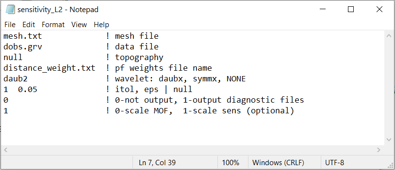

.. _grav3d_sens_input:

Sensitivity Matrix Input File
=============================

Before running the inversion, we must construct the sensitivity matrix.
The sensitivity matrix defines the linear relationship between the data and model.
The sensitivity matrix is computed using the program **magsen3d_60.exe**, see :ref:`running the program <grav3d_sens>`.

The lines of input file for the executable are as follows:

.. tabularcolumns:: |L|C|C|

+--------+--------------------------------------------------------------------+-------------------------------------------------------------------+
| Line # | Description                                                        | Description                                                       |
+========+====================================================================+===================================================================+
| 1      | :ref:`Tensor mesh<grav3d_input_sens_ln1>`                          | path to tensor mesh file                                          |
+--------+--------------------------------------------------------------------+-------------------------------------------------------------------+
| 2      | :ref:`Data file<grav3d_input_sens_ln2>`                            | observed data file                                                |
+--------+--------------------------------------------------------------------+-------------------------------------------------------------------+
| 3      | :ref:`Topography<grav3d_input_sens_ln3>`                           | topography                                                        |
+--------+--------------------------------------------------------------------+-------------------------------------------------------------------+
| 4      | :ref:`Depth/distance weights<grav3d_input_sens_ln4>`               | name of depth or distance weights file                            |
+--------+--------------------------------------------------------------------+-------------------------------------------------------------------+
| 5      | :ref:`Wavelet type<grav3d_input_sens_ln5>`                         | wavelet type used in compression                                  |
+--------+--------------------------------------------------------------------+-------------------------------------------------------------------+
| 6      | :ref:`Wavelet compression parameters<grav3d_input_sens_ln6>`       | *tol eps*                                                         |
+--------+--------------------------------------------------------------------+-------------------------------------------------------------------+
| 7      | :ref:`Output diagnostic options<grav3d_input_sens_ln7>`            | 0 (no) or 1 (yes)                                                 |
+--------+--------------------------------------------------------------------+-------------------------------------------------------------------+
| 8      | :ref:`Scale sensitivity options<grav3d_input_sens_ln8>`            | scale for L2 or sparse inversion                                  |
+--------+--------------------------------------------------------------------+-------------------------------------------------------------------+

An example of the input file for L2 inversion is shown below. You may also `Download the input file for a sparse norm inversion <https://github.com/ubcgif/grav3d/raw/v6/assets/input_files/sens_sparse.inp>`__ .

     Example input file for constructing the sensitvity matrix (`Download <https://github.com/ubcgif/grav3d/raw/v6/assets/input_files/inv/sens_L2.inp>`__ ).

Line Descriptions
^^^^^^^^^^^^^^^^^

.. _grav3d_input_sens_ln1:

    - **Tensor Mesh:** file path to a :ref:`tensor mesh <meshfile>` file

.. _grav3d_input_sens_ln2:

    - **Data File:** file path to the :ref:`observations file<gravfile>`

.. _grav3d_input_sens_ln3:

    - **Topography:** there are two options for defining the topography.

        - type *null* for no defined topography (all cells are active)
        - provide the *filepath* to to a :ref:`topography file <topofile>`

.. _grav3d_input_sens_ln4:

    - **Depth/Distance Weights:** Gravity inversion has a tendancy place anomalous bodies near the observation locations due to high sensitivities. The output of *pfweights.exe* applies a depth of distance weighting to counteract these effects. Here, the user provides the file name for file an output file that contains the weights being applied to each cell.

.. _grav3d_input_sens_ln5:

    - **Wavelet Type:** type of wavelets used to compress the rows of the sensitivity matrix. The choices are:

        - Use the flag *NONE* for no wavelet compression
        - For symmlets, choose one of *symm4*, *symm5* or *symm6*
        - For Daubechies, choose one of *daub1*, *daub2*, ... , *daub6*

.. note:: For most inversions, *daub2* works well. Other options remain for the user's own experimentation.

.. _grav3d_input_sens_ln6:

    - **Wavelet Parameters:**

        - Use the flag *null* if no wavelet compression is used
        - Otherwise, the wavelet compression is defined by two parameters *itol* and *eps* which are separated by a space.

            - *itol=1:* the program calculates the relative threshold and *eps* is the relative reconstruction error of the sensitivity. A reconstruction error of *eps* = 0.05 (95%) is usually adequate.
            - *itol=2:* the user defines the threshold level and *eps* is the threshold to be used.

.. _grav3d_input_sens_ln7:

    - **Output diagnostic options:**

        - *0* - Do not output diagnostic files
        - *1* - Output diagnostic files. In this case, the diagnostic files are: (1) the predicted data for a model of ρ=0.1 with the wavelet compressed sensitivity, (2) the predicted data for a model of ρ=0.1 with the full sensitivity, (3) the averaged sensitivity in each cell based on the wavelet compression. An extra line in the log file is also written giving the user the achieved reconstruction error (e.g. eps when itol=1 from above).

.. _grav3d_input_sens_ln8:

    - **Scale sensitivity options:** 

        - *1* - Scale sensitivity by the distance weighting function. This is used when performing an L2 inversion. 
        - *0* - Scale the model objective function by the distance weighting. This option **must** be used when using compact or blocky norms.