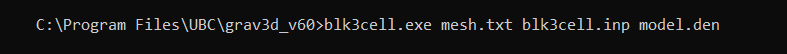

.. _grav3d_blk3cell:

Create Model
============

To generate the tensor model on the tensor mesh, open a command window. In order, enter the path to **blk3cell.exe**, followed by the path to the tensor mesh file name (**mesh.txt**), followed by the path to the :ref:`input file <grav3d_blk3cell_input>` (denoted here as **blk3cell.inp**), followed by the desired name (or full path) for the output model file (denoted here as **model.sus**), all separated by spaces.

**blk3cell.exe** outputs a :ref:`model<modelFile>` (**model.den**) which contains a single value for each cell in the tensor mesh **mesh.txt**.

