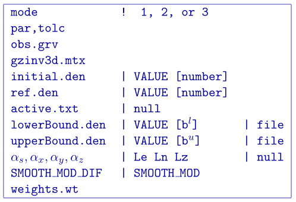
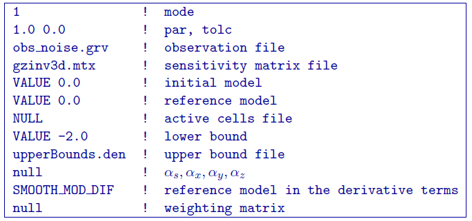
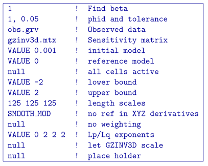

.. _gzinv3d:

GZINV3D
=======

This program actually performs the 3D inversion of gravity data. Command line usage is:

``gzinv3d gzinv3d.inp [nThreads]``

For a sample input file type:

``gzinv3d -inp``

The argument specifying the number of CPU threads used in the OpenMP format is optional. If this argument is not given to the program, chooses to use all of the CPU threads on the machine. This argument allows the user to specify half, for example, of the threads so that the program does not take all available RAM. Note that this option is not available in the MPI-based code used for clusters.

Input files
-----------

Input files can be any file name. If there are spaces in the path or file name, you *MUST* use quotes around the entire path (including the filename). Files that may be used by the inversion are:

#. ``obs.grv``: Mandatory :ref:`observations file <gravfile>`.

#. ``gzinv3d.mtx``: Mandatory sensitivity matrix from :ref:`gzsen3d`

#. ``initial.den``: Optional initial :ref:`model file <modelFile>`. This can be substituted by a value within the input file (see below).

#. ``ref.den``: Optional reference :ref:`model file <modelFile>`. This can be substituted by a value within the input file (see below).

#. ``active.txt``: Optional ref:`active model file <activeFile>`

#. ``upperBound.den``: Optional upper bounds :ref:`model file <modelFile>`. A value can be used to set a global bound (see below).

#. ``lowerBound.den``: Optional lower bounds :ref:`model file <modelFile>`. A value can be used to set a global bound (see below).

#. ``weights.wt``: Optional :ref:`weighting file <weightsFile>`.

#. ``gzinv3d.inp``: The control file containing the options. Does not need to be specifically called "gzinv3d.inp".

Format of the control file has been changed since previous version. Any numeric entries beyond the trade-off parameter, and tolerance should be preceded by ``VALUE``. The input files has been modified as follows:

 

The parameters within the control file are:

-  ``mode``: An integer specifying one of three choices for determining the trade-off parameter.

   #. ``mode=1``: the program chooses the trade off parameter by carrying out a line search so that the target value of data misfit is achieved (e.g., :math:`\phi_d^*=N`).

   #. ``mode=2``: the user inputs the trade off parameter.

   #. ``mode=3``: the program calculates the trade off parameter by applying the GCV analysis to the inversion without positivity.

- ``par``, ``tolc`` Two real numbers that are dependent upon the value of mode.
   
   #. ``mode=1``: the target misfit value is given by the product of ``par`` and the number of data :math:`N` , i.e., ``par=1`` is equivalent to :math:`\phi_d^*=N` and ``par=0.5`` is equivalent to :math:`\phi_d^*=N/2` . The second parameter, ``tolc``, is the misfit tolerance in fractional percentage. The target misfit is considered to be achieved when the relative difference between the true and target misfits is less than ``tolc``. Normally, ``par=1`` is ideal if the true standard deviation of error is assigned to each datum. When ``tolc=0``, the program assumes a default value of ``tolc=0.02`` since this number must be positive.

   #. ``mode=2``: ``par`` is the user-input value of trade off parameter. In this case, ``tolc`` is not used by the program.

   #. ``mode=3``: none of the two input values are used by the program. However, this line of input still needs to be there.

   | **NOTE:** When both ``par`` and ``tolc`` are used. When only ``par`` is used. When ``mode=3``, neither nor ``tolc`` are used. However, the third line should always have two values.

-  ``obs.grv``: Input data file. The file must specify the standard deviations of the error. By definition these values are greater than zero.

-  ``gzinv3d.mtx``: The binary file of sensitivities created by :ref:`gzsen3d`.

-  ``initial.den``: The initial density contrast model can be defined as a value for uniform models (e.g. ``VALUE 0.001``), or by a filename. The initial model must be within the upper and lower bounds.

-  ``ref.den``: The reference density contrast model can be defined as a value for uniform models (e.g. ``VALUE 0``), or by a filename (for non-uniform reference models).

- ``active.txt``: The :ref:`active model file <activeFile>` defining which cells in the model are allowed to be solved.

-  ``lowerBound.den``: The lower bounds model can be defined as a value for uniform models (e.g., ``VALUE -1``) or by a filename.

-  ``upperBound.den``: The upper bounds model can be defined as a value for uniform models (e.g., ``VALUE 1``) or by a filename.

- :math:`\alpha_s, \alpha_x, \alpha_y, \alpha_z`: Coefficients for the each model component. :math:`\alpha_s` is the smallest model component. Coefficient for the derivative in the easting direction. :math:`\alpha_y` is the coefficient for the derivative in the northing direction. The coefficient :math:`\alpha_z` is for the derivative in the vertical direction.

   If ``null`` is entered on this line, then the above four parameters take the following default values:  :math:`\alpha_s = 0.0001, \alpha_x = \alpha_y = \alpha_z = 1`. All alphas must be positive and they cannot be all equal to zero at the same time.

   **NOTE:** The four coefficients in line 9 of the control file may be substituted for three corresponding *length scales* :math:`L_x, L_y` and :math:`L_z` and are in units of metres. To understand the meaning of the length scales, consider the ratios :math:`\alpha_x/\alpha_s`, :math:`\alpha_y/\alpha_s` and :math:`\alpha_z/\alpha_s`. They generally define smoothness of the recovered model in each direction. Larger ratios result in smoother models, smaller ratios result in blockier models. The conversion from :math:`\alpha`\'s to length scales can be done by:

   .. math::
      L_x = \sqrt{\frac{\alpha_x}{\alpha_s}} ; ~L_y = \sqrt{\frac{\alpha_y}{\alpha_s}} ; ~L_z = \sqrt{\frac{\alpha_z}{\alpha_s}}
      :label: lengths

   When user-defined, it is preferable to have length scales exceed the corresponding cell dimensions. Typically having length scales of four cell widths are a good starting point.

- ``SMOOTH_MOD``: This option was not available in previous versions of the code and can be used to define the reference model in and out of the derivative terms. The options are: ``SMOOTH_MOD_DIF`` (reference model is defined in the derivative terms) and ``SMOOTH_MOD`` (reference model is defined in only the smallest term). See the :ref:`model object function <mof>` section for details.

- ``weights.wt``: Name of the :ref:`weights file <weightsFile>` containing weighting matrices. If ``null`` is entered, default values of unity are used (no extra weighting).

- ``VALUE P Qx Qy Qz``: The Lp/Lq exponents for the :ref:`model objective function <lplqMOF>`. The P is for the smallest model component and the Qs are for the spatial components. This line is optional and the L2 norm will be assumed for inputs of ``null`` or if the file ends on the previous line. 

- ``scale,eps,epsGrad``: The scaling between Lp and Lq components in range :math:`[0,1]`. ``eps`` is an effective zero for the model values. ``epsGrad`` is an effective zero value for the change in model values spatially (i.e., derivatives). The program will calculate these zeros based on a single standard deviation of the L2 model if ``null`` is given with no extra scaling between Lp and Lq (``scale = 0.5``). **Note**: This line is optional and is only required if the LpLq constants are given or MOF derivatives below. 

- ``mof.wt``: This input is currently disabled because of the upgrade to the model objective function. Use ``null`` or end the file prematurely.

Example of control file
~~~~~~~~~~~~~~~~~~~~~~~

Below is an example of a control file with comments for an L2 inversion.

Below is an example of an input file for an Lp/Lq file. The program will try to find a sparse model (Lp=0) with smooth sides (Lqx=Lqy=Lqz=2) and fit the data misfit to within 5% of the desired misfit.

Output files
------------

Five general output files are created by the inversion. They are:

#. ``gzinv3d.log``: The log file containing the minimum information for each iteration and summary of the inversion.

#. ``gzinv3d.out``: The "developers" log file containing the details of each iteration including the model objective function values for each component, number of conjugate gradient iterations, etc.

#. ``gzinv3d_xxx.den``: Density contrast :ref:`model files <modelFile>` output after each "xxx" iteration (i.e., ``gzinv3d_012.den``)

#. ``gzinv3d_xxx.pre``: :ref:`Predicted data files <gravFile>` (without uncertainties) output after each "xxx" iteration.

