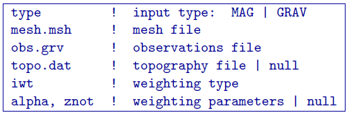
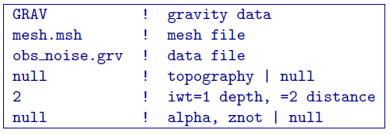

.. _pfweight:

PFWEIGHT
========

This program performs the depth weighting function calculation. This allows users the flexibility to either use this code or their in-house code for the weighting calculation. Command line usage:

``pfweight weights.inp [nThreads]``

For a sample input file type:

``pfweight -inp``

The argument specifying the number of CPU threads used in the OpenMP format is optional. If this argument is not given to the program, chooses to use all of the CPU threads on the machine. This argument allows the user to specify half, for example, of the threads so that the program does not take all available RAM. Note that this option is not available in the MPI-based code used for clusters.

Input files
-----------

Format of the control file:

The input parameters for the control file are:

- ``type``: Use ``GRAV`` to have ``pfweight`` read gravity files.

-  ``mesh.msh``: Name of 3D :ref:`mesh file <meshFile>`.

- ``obs.grv`` The :ref:`data file <gravFile>` that contains the observation locations and the observed vertical gravity anomaly with estimated standard deviation.

-  ``topo.dat``: Surface :ref:`topography file <topoFile>`. If ``null`` is entered, the surface will be treated as being flat on the top of the mesh.

-  ``iwt``: An integer (``1`` or ``2``) identifying the type of generalized depth weighting to use in the inversion.
     | =1 for depth weighting (not applicable to borehole data);
     | =2 for distance weighting.

-  ``alpha``, ``znot``: Parameters defining the depth weighting function: 
     | When ``iwt=1``, ``alpha`` and ``znot`` are used as :math:`\alpha` and :math:`z_0` to define the *depth* weighting according to equation :eq:`depthw`. 
     | When ``iwt=2``, ``alpha`` and ``znot`` are used as :math:`\alpha` and :math:`(R_o)` to define the *distance* weighting according to equation :eq:`distw`.
     | **NOTE 1**: If ``null`` is entered on this line (line 6), then the program sets ``alpha=2`` and calculates the value of :math:`z_o` based upon the mesh and data location. This is true for ``iwt=1`` or ``iwt=2``
     | **NOTE 2**: For most inversions, setting this input line to ``null`` is recommended. The option for inputing :math:`\alpha` and :math:`z_o` is provided for experienced users who would like to investigate the effect of the generalized depth weighting for special purposes. The value of :math:`\alpha` should normally be close to 2.0. Smaller values of give rise to weaker weighting as distance increases from the observation locations.

Example of input file
~~~~~~~~~~~~~~~~~~~~~

Output files
------------

The program outputs ``x_weight.txt``. A file in the format, which contains weights for each cell, based on equations :eq:`depthw` (x = "depth") and :eq:`distw` (x = "distance"). A log file ``pfweight.log`` is also written.
