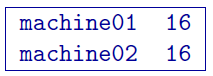

Running the programs
====================

The software package GRAV3D uses five general codes:

- ``GZFOR3D``: performs forward modelling.

- ``PFWEIGHT``: calculates the depth weighting function.

- ``GZSEN3D``: calculates sensitivity.

- ``GZINV3D``: performs 3D gravity inversion.

- ``GZPRE3D``: multiplies the sensitivity file by the model to get the predicted data.

This section discusses the use of these codes individually using.

Introduction
------------

All programs in the package can be executed under Windows or Linux environments. They can be run by typing the program name followed by a control file in the ``command prompt`` (Windows) or ``terminal`` (Linux). They can be executed directly on the command line or in a shell script or batch file. When a program is executed without any arguments, it will print the usage to screen.

Execution on a single computer
~~~~~~~~~~~~~~~~~~~~~~~~~~~~~~

The command format and the control, or input, file format on a single machine are described below. Within the command prompt or terminal, any of the programs can be called using:

program arg\ :math:`_1` [arg\ :math:`_2` :math:`\cdots` arg\ :math:`_i`]

where:

- program: the name of the executable

- arg\ :math:`_i`: a command line argument, which can be a name of corresponding required or optional file. Typing as the control file, serves as a help function and returns an example input file. Some executables do not require control files and should be followed by multiple arguments instead. This will be discussed in more detail later in this section. Optional command line arguments are specified by brackets: `[ ]`

Each control file contains a formatted list of arguments, parameters and filenames in a combination and sequence specific for the executable, which requires this control file. Different control file formats will be explained further in the document for each executable.

Execution on a local network or commodity cluster
~~~~~~~~~~~~~~~~~~~~~~~~~~~~~~~~~~~~~~~~~~~~~~~~~

The ``GRAV3D`` program library's main programs have been parallelized with Message Pass Interface (MPI). This allows running these codes on more than one computer in parallel. MPI installation package can be downloaded from http://www.mcs.anl.gov/research/projects/mpich2/. The following are the requirements for running an MPI job on a local network or cluster:

-  An identical version of MPI must be installed on all participating machines

-  The user must create an identical network account with matching "username" and "password" on every machine

-  Both the executable folder and the working directory should be "shared" and visible on every participating computer

-  Before the MPI job is executed, the firewall should be turned off on every participating computer

-  The path should be defined to the executable directory

The following is an example of a command line executing an MPI process:

``C:\Program Files\MPICH2\bin\mpiexec.exe -machinefile machine.txt nproc -priority 0 gzinv3d``

An explanation of the arguments used in this command line are:

-  Properly defined path to the ``mpiexec``.

-  The list of participating machines will be read from a "machine file."

-  Name of the machine file. This file lists the network names of the participating machines and number of processors to be allocated for the MPI job for each machine. The following is an example of a machine file:

In this simple example, there are two participating machines (named ``machine01`` and ``machine02``) are required to allocate 16 processors for the MPI job.

-  The total number of allocated processors. This number should be equal to the sum of all processors listed for all machines in the machine file.

-  Sets the priority of the process. Integer grades from -1 (lowest) to 4 (highest) follow. Higher priority means that RAM and processing resources will be primarily allocated for this process, at expense of lower priority processes. Generally, a large job should be assigned a lower priority, as selective resource allocation may slow down other important processes on the computer, including those needed for stable functioning of the operating system.

-  The name of the executable. In our case it is assumed that there is an existing path to the executable directory, otherwise proper path should be provided.

Input and output files
----------------------

  .. toctree::
    :maxdepth: 1

    Forward modelling (GZFOR3D) <programs/gzfor3d>
    Depth/distance weighting (PFWEIGHT) <programs/pfweight>
    Sensitivity calculation (GZSEN3D) <programs/gzsen3d>
    Inversion (GZINV3D) <programs/gzinv3d>
    Predicted data from sensitivity (GZPRE3D) <programs/gzpre3d>

