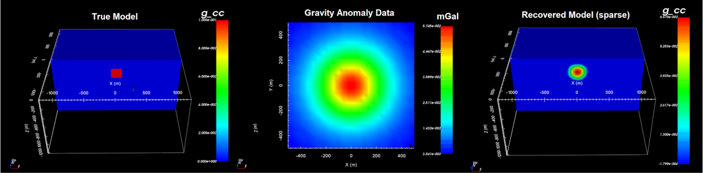

.. important:: In 2022-10, a more exact definition of the regularization was implemented in gzinv3d_60.exe for sparse-norm inversion. The package containing the improved executable was released as GRAV3D v6.0.1. Be aware that GRAV3D v6.0 and v6.0.1 have all the same features and use the same executable names. Differences in the recovered model using each package were found to be insignificant.

GRAV3D v6.0/v6.0.1 package
==========================

GRAV3D v6.0/v6.0.1 is a program library for carrying out 3D forward modelling and inversion of gravity data.

     True model, gravity anomaly data and the recovered model.

Highlights of Grav3D v6.0/v6.0.1
^^^^^^^^^^^^^^^^^^^^^^^^^^^^^^^^

Many advancements have been made since the previous version of this coding package.
Highlights of Grav3D v6.0/v6.0.1 include:

    - the ability to forward model and invert surface, borehole, and airborne gravity data in 3D
    - sensitivity weighting so that targets recovered through inversion are placed at the correct depth
    - the ability to recover compact and/or blocky models using sparse norms, in additional to smooth models using a standard least-squares approach
    - implementing wavelet compression to reduce the storage cost of the sensitivity matrix and allow the user to solve larger problems

Sponsorship
^^^^^^^^^^^

The current improvements have been funded by the GIFtools Consortium which included “Potential fields and software for advanced inversion” (2012-2020) sponsored by Teck, Glencore, BHP Billiton, Vale, Cameco, Barrick, Rio Tinto, and Anglo American.

Contents
^^^^^^^^

.. toctree::
    :numbered:
    :maxdepth: 2

    Package overview <content/overview>
    Background theory <content/theory>
    Elements <content/elements>    
    Running the programs <content/runPrograms>
    Example <content/examples>
    References <references>
    
..  Need to run examples: maybe nutcracker?
..    Examples <content/examples>

