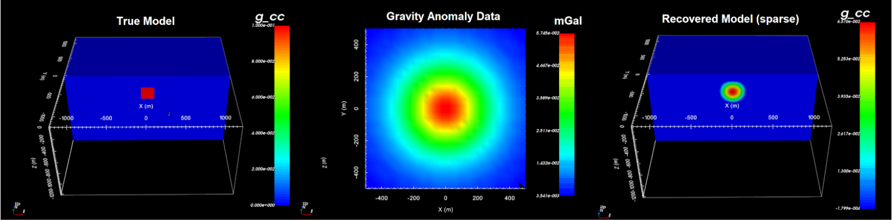

.. important:: The features and executable names within the GRAV3D the v6.0, v6.0.1, v6.0.2 and v6.0.3 packages remain the same. Differences in version number correspond to improvements in performance and computational efficiency.

GRAV3D v6 Package
=================

GRAV3D v6 is a program library for carrying out 3D forward modelling and inversion of gravity data.

     True model, gravity anomaly data and the recovered model.

Highlights
^^^^^^^^^^

**General GRAV3D Package Highlights:**

    - the ability to forward model and invert surface, borehole, and airborne gravity anomaly data in 3D
    - distance weighting so that targets recovered through inversion are placed at the correct depth
    - implementing wavelet compression to reduce the storage cost of the sensitivity matrix and allow the user to solve larger problems

**v6.0 (released 2021-05):**

    - the ability to recover compact and/or blocky models using sparse norms, in additional to smooth models using a standard least-squares approach

**v6.0.1 (released 2022-10):**

    - implementation of a more exact definition for the regularization 

**v6.0.2 (released 2022-11):**

    - general sensitivities that can be used for least-squares or sparse-norm inversion
    - improved wavelet compression which acts on weighted sensitivities
    - update preconditionner during IRLS iterations to reduce number of conjugate gradient solves

**v6.0.3 (released 2023-09):**

    -  an augmentation was made to preserve high performance for extremely large problems.

**v6.0.4 (released 2025-04):**

    - some unintended behavior was observed in the sparse norm inversion when an active cells file is used in the inversion input file. This issue is corrected in v6.0.4.

Sponsorship
^^^^^^^^^^^

The current improvements have been funded by the GIFtools Consortium which included “Potential fields and software for advanced inversion” (2012-2020) sponsored by Teck, Glencore, BHP Billiton, Vale, Cameco, Barrick, Rio Tinto, and Anglo American.

Contents
^^^^^^^^

.. toctree::
    :numbered:
    :maxdepth: 2

    Package overview <content/overview>
    Background theory <content/theory>
    Elements <content/elements>    
    Running the programs <content/runPrograms>
    Example <content/examples>
    References <references>

